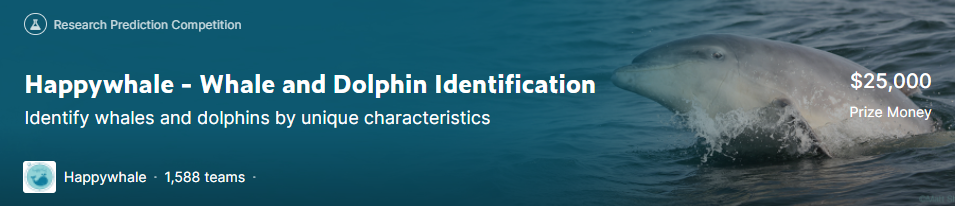

# Whale and dolphin identification



This repo created for the Kaggle competition "Happywhale - Whale and Dolphin Identification" by artyomnaz, max_vasyuk

### Requirements
```
git clone https://github.com/artyomnaz/whale_and_dolphin_identification.git
cd whale_and_dolphin_identification
pip install -r requirements.txt
```

### Datasets
We used the original dataset and the converted [Jan Bre's backfintfrecords](https://www.kaggle.com/datasets/jpbremer/backfintfrecords) dataset to the competitions dataset format.

### Results
Our place on the public leaderboard is 492 and on the private leaderboard is 484. Our score is 0.73212 (private) and 0.77772 (public).
